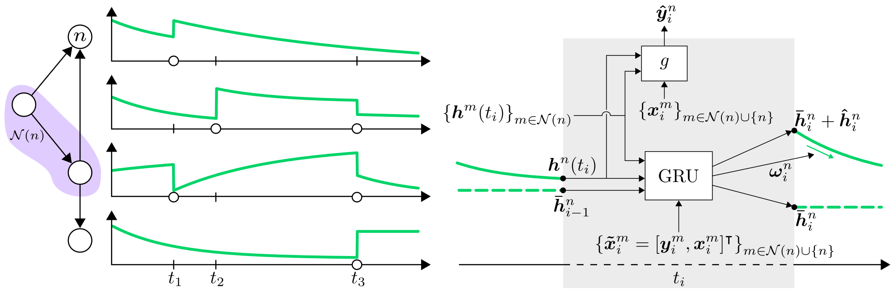

# Temporal Graph Neural Networks for Irregular Data (TGNN4I)
<p align="middle">
  
</p>

This repository contains the code for our paper [*Temporal Graph Neural Networks for Irregular Data*](https://arxiv.org/abs/2302.08415), to appear at AISTATS 2023.

If you find our work useful, please cite:
```
@inproceedings{tgnn4i,
    author = {Oskarsson, Joel and Sid{\'e}n, Per and Lindsten, Fredrik},
    title = {Temporal Graph Neural Networks for Irregular Data},
    booktitle = {Proceedings of The 26th International Conference on Artificial Intelligence and Statistics},
    year = {2023}
}
```

## Installation
Use python 3.9. Note that installation order is important.

1. Install required packages with `pip install -r requirements.txt`
2. Install PyTorch Geometric (version 2.0.4). With `CUDA` set to one of (`cu102`, `cu113`, `cu115`, `cpu`), run:
```
pip install torch-scatter==2.0.9 torch-sparse==0.6.13 -f https://data.pyg.org/whl/torch-1.11.0+$CUDA.html
pip install torch-geometric==2.0.4
```
For more information see the [PyTorch Geometric documentation](https://pytorch-geometric.readthedocs.io/en/latest/notes/installation.html).

3. Install PyTorch Geometric Temporal with `pip install torch-geometric-temporal==0.51.0`.

If you instead want to use a containerized setup there is also a specification file `singularity_environmment.def` that can be used to build a [singularity](https://sylabs.io/docs/) container.

## Dataset
We provide both the complete, pre-processed datasets and instructions for running the pre-processing.

### Download datasets
All datasets used in the paper can be downloaded from [this link](https://liuonline-my.sharepoint.com/:f:/g/personal/joeos82_liu_se/EkXmNJYB8hNBnhnSeNAoDKkBIES520vzayAtmRT-Rh_cvQ?e=Px8z8g).
Each dataset consists of a folder containing a specification file `config.json` and a `.pickle`-FILE WIth the actual data.
The configuration file specifies the exact paramters used during pre-processing of the data.
Place these folders in the `dataset` directory.

### Pre-processing
If you want to perform the pre-processing from scratch, this can be done using the provided scripts:

* **Traffic data**: `scripts/traffic_preprocessing.sh`, which uses `preprocess_traffic.py`
  * The original traffic data is downloaded directly from the script through the PyTorch Geometric Temporal library.
* **USHCN data**: `scripts/ushcn_preprocessing.sh`, which uses `preprocess_ushcn.py`
  * Our pre-processing for the USHCN data assumes that you have first ran the pre-processing of [De Brouwer et al.](https://github.com/edebrouwer/gru_ode_bayes), and then placed the resulting files in the directory `raw_data/ushcn_daily`.
* **Synthetic periodic data**: `scripts/generate_periodic.sh`, which uses `generate_node_data.py`

## Running the code
Training and evaluating the models can be done using `main.py`. Run `python main.py --help` for a list of options.
You can also specify all options in a json-file and call the script as `python main.py --config config.json`.

### W&B
The project is fully integrated with [Weights & Biases](https://www.wandb.ai/) (W&B) for logging and visualization, but can just as easily be used without it.
When W&B is used, training configuration, training/test statistics and plots are sent to the W&B servers and made available in an interactive web interface.
If W&B is turned off, logging instead saves everything locally to a directory like `wandb/dryrun...`.
Information like evaluation metrics and loss values are also written directly to standard output.
The W&B project name is set to `irregular-tgnns`, but this can be changed in `constants.py`.
See the [W&B documentation](https://docs.wandb.ai/) for details.

If you would like to login and use W&B, run:
```
wandb login
```
If you would like to turn off W&B and just log things locally, run:
```
wandb off
```

### Command line options
All command line options are listed in `main.py` together with short descriptions.
Some key options are:

 * `--model`: Which model to use. Can be any of `tgnn4i`, `grud_node`, `grud_joint`, `transformer_node` or `transformer_joint`.
 * `--dataset`: Which dataset to use. Corresponds to the directory name inside the `dataset` directory.
 * `--decay_type`: Parametrization to use for exponental decay dynamics in GRU-based models. Set to `none` to turn use a static latent state in-between observations.
 * `--periodic`: If the periodic dynamics should be used in GRU-based models. Turn on and off by setting to integers `1`/`0`.
 * `--test`: Set to `1` to evaluate the model on the test set after training.

## Experiments
Descriptions of exact parameters for all experiments in `yaml`-format can be found in the `sweeps` directory.
If you are using W&B these files can be used directly to set up [sweeps](https://docs.wandb.ai/guides/sweeps/quickstart) to run each experiment.
They can otherwise be straightforwardly translated into bash-scripts.

* Sweep files named `..._hypertune.yaml` describe the hyperparameter tuning done for different models and datasets.
* Sweep files named `..._seeded.yaml` describe the main experiments from the paper, where models are trained using 5 different seeds.
* The sweep file `loss_weight_experiment.yaml` describes the experiment from section 4.5 in the paper, where different loss weighting functions are used.

## Baselines
Below are instructions for how to train and evaluate the baseline models from the paper.

### GRU-D
The GRU-D baselines can be used by setting `--model` to `grud_node` or `grud_joint`.

### Transformers
The Transformer baselines can be used by setting `--model` to `transformer_node` or `transformer_joint`.
Note that for the Transformer models the option `--gru_layers` controls the number of transformer layers to use.
The hidden dimensionality in these layers is still controlled by the `--hidden_dim` option.

### LG-ODE
We provide our modified version of the original LG-ODE implementation in [a separate repository](https://github.com/joeloskarsson/LG-ODE).
To use our datasets with the LG-ODE code they have to be converted to a suitable format.
This can be done by using the `convert_to_lgode.py` script, which will save the converted data in a directory called `lgode_dataset`.

When evaluating the LG-ODE model on the test set, the output is a `.pt`-file with predictions.
To compute errors based on such a file with predictions the script `eval_saved_predictions.py` can be used.

### Predict Previous
The "Predict Previous" baseline can be used by running the script `simple_baselines.py` with the option `--baseline` set to `pred_prev`.
